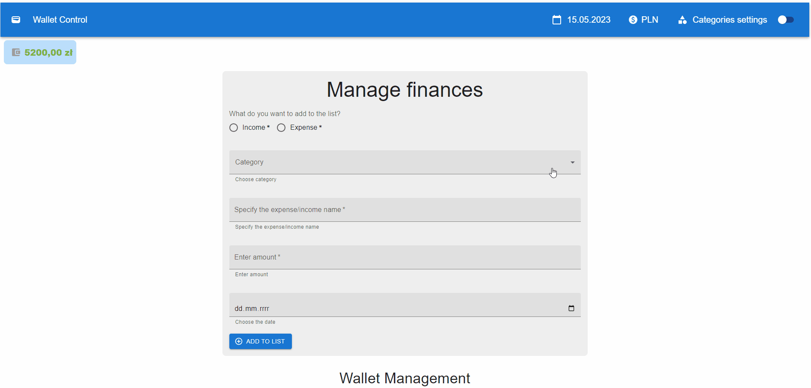

# 💰Wallet Control - A Simple and User-Friendly Budget Management Application

Wallet Control is a responsive web application developed using React JS, Material UI, and hooks.

This application is a simple tool for managing your personal finances. It allows you to track your expenses and incomes, choose your preferred currency, and view your balance in real-time.

With Wallet Control, you can easily keep track of your spending and saving habits, set financial goals, and stay on top of your finances.

## 🔎Demo:

[Manage your finances now!](https://maxnatalia.github.io/wallet-control/)

## 👓Preview:

## 📌Features:

- **Add New Items**: Add new items to your expense or income lists with just a few clicks.
- **Local Storage**: All your data is stored locally, so you can access it even when you're offline.
- **Theming**: Choose from a range of color themes to customize the look and feel of the app.
- **Expense and Income Lists**: Create and manage lists of your expenses and income, and view them in a variety of ways, including **grid and table views**.
- **Currency Selector**: Choose your preferred currency from a list of available options.
- **Search and Filter**: Quickly search for specific items in your expense and income lists, and filter them by variant: incomes/expenses
- **Edit and Delete**: Easily edit or delete any item in your expense or income lists.
- **Balance Calculation**: Wallet Control automatically calculates your balance based on your income and expenses.
- **Add your own categories**: You can add/set your own categories and use them in app, or choose basic categories.
- **Responsive**: this app can be used on different devices
- **Alert information**: When something went wrong - you can see different alert messages

## 🛠️Technologies used:

- [x] React JS
- [x] Hooks and Custom Hooks
- [x] Material UI
- [x] JavaScript
- [x] ES6+features
- [x] Markdown

This project was bootstrapped with [Create React App](https://github.com/facebook/create-react-app).

## Available Scripts

In the project directory, you can run:

### `npm start`

Runs the app in the development mode.\
Open [http://localhost:3000](http://localhost:3000) to view it in your browser.

The page will reload when you make changes.\
You may also see any lint errors in the console.

<!-- ### `npm test`

Launches the test runner in the interactive watch mode.\
See the section about [running tests](https://facebook.github.io/create-react-app/docs/running-tests) for more information. -->

### `npm run build`

Builds the app for production to the `build` folder.\
It correctly bundles React in production mode and optimizes the build for the best performance.

The build is minified and the filenames include the hashes.\
Your app is ready to be deployed!

See the section about [deployment](https://facebook.github.io/create-react-app/docs/deployment) for more information.

### `npm run eject`

**Note: this is a one-way operation. Once you `eject`, you can't go back!**

If you aren't satisfied with the build tool and configuration choices, you can `eject` at any time. This command will remove the single build dependency from your project.

Instead, it will copy all the configuration files and the transitive dependencies (webpack, Babel, ESLint, etc) right into your project so you have full control over them. All of the commands except `eject` will still work, but they will point to the copied scripts so you can tweak them. At this point you're on your own.

You don't have to ever use `eject`. The curated feature set is suitable for small and middle deployments, and you shouldn't feel obligated to use this feature. However we understand that this tool wouldn't be useful if you couldn't customize it when you are ready for it.
